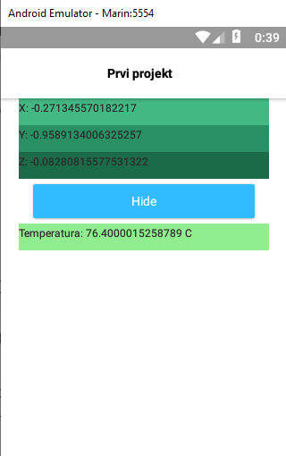
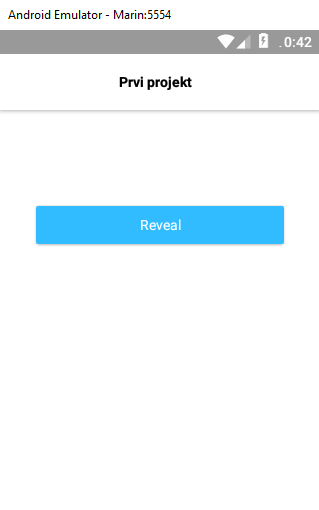
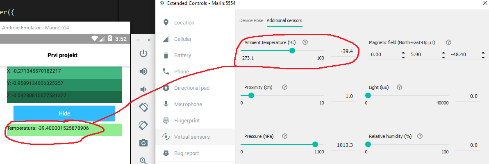
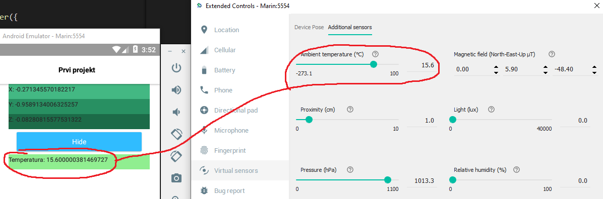

### 2. Seminarski rad: Senzor temperature


#### 1. Uvod

Za stvaranje aplikacije korištena je stranica iz primjera sa nastave kao podlaga za daljnji razvoj nove aplikacije.

##### 1.1. Sakrivanje podataka

U već postojeći `home-page.xml` predložak dodan je novi gub koji će na korisnikov dodir prikazati ili sakriti podatke o senzoru.

```xml
<Button text="{{ btnText }}" class="-primary" row="3" col="1" tap="{{ onTap }}"></Button>
```
Za prikaz teksta na gumbu koristi se varijabla `{{ btnText }}` s obzirom na to da je će se ovisno o trenutnom stanju mjenjati njegov sadržaj. Atribut `tap` na označava funkciju koja će se pozvati na dodir tog elementa.
Prije samog definiranja funkcije stvorit ćemo dvije varijable koje koje označavaju stanje gumba, a to su `rev` i `hide`. `rev` sadrži tekst `Reveal` odnosno `hide` sadrži tekst `Hide`.
Da bi mogli koristiti funkciju `onTap` potrebno ju je definirati u `hove-view-model.js`. U već postoječem viewModel objektu definiramo novu funkciju imena `onTap` na slijedeći način:

```js
    viewModel.onTap = function(){
        if (viewModel.visibility == 'visible'){
            viewModel.set('visibility', hid)
            viewModel.set('btnText', rev)
        }
        else{
            viewModel.set('visibility', vis)
            viewModel.set('btnText', hide)
        }
    }
```
Atribut `visibility`, čija je početna zadana vrijednost postavljena na `visible`, nam označava hoće li se element sa tim atributom vidjeti na ekranu. Svi elementi `GridLayout`-a u `home-page.xml` imaju vrijednost tog atributa postavljeno kao varijablu. Svakim klikom gumba mijenjamo vrijednosti te varijable vizibilnosti i mjenjamo text prikaza na gumbu.
.
.

##### 1.2. Senzor temperature

Obrađeni senzor u seminaru je senzor `TYPE_AMBIENT_TEMPERATURE` koji predstavlja senzor temperature. S obzirom na to da nema puno dostupnih pluginova ili pluginovi zahtjevaju dodatne postavke od korisnika, bilo je potrebno proučiti `Java` i `Kotlin` dokumentaciju za korištenje android senzora. 
Da bi pristupili sirovim podacima iz senzora koristimo `Sensor Framework`. Razvojni okvir je dio `android.hardware` paketa koja sadrži sljedeće klase i 
Da bi mogli koristiti senzor potrebno je koristiti više elemenata a to su:
- SensorManager
    - Dopušta nam da pristupimo senzorima uređaja
- SensorEventListener
    - Sluša odazive i promjene vrijednosti senzora koji se aktiviraju pri `SensorEvent`-u
- SensorEvent
    - Pruža informacije o eventima senzora
- Sensor
    - Senzor koji želimo promatrati u našoj aplikaciji

Potrebno je napomenuti da ako želimo koristiti `Sensor Framework` moramo prvo imati kontekst naše aplikacije.
- Context
    - Opisuje trenutno stanje aplikacije
    - Može se koristiti za dobiti informacije o aktivnosti aplikacije
    - Može se koristiti za pristup resursima, bazama podataka itd...

Za početak u `home-view-model.js` definiramo varijablu u koju spremamo kontekst aplikacije te nakon toga definiramo SensorManagera da možemo pristupiti resursima uređaja

```js
const context = androidUtils.getApplicationContext();
var man = context.getSystemService(android.content.Context.SENSOR_SERVICE);
```

Nakon toga definiramo koji senzor da nam SensorManager da koristeći funkciju `get_default_Senzor()`. U slučaju da postoji više senzora iste vrste, sa funkcijom `get_default_Senzor()` dohvatit ćemo zadani senzor. U primjeru dohvaćamo senzor temperature `TYPE_AMBIENT_TEMPERATURE`.

```js
let startSensor = man.getDefaultSensor(android.hardware.Sensor.TYPE_AMBIENT_TEMPERATURE);
```

Sada kada imamo spreljen naš senzor, da bi mogli pristupit podacima i dobivat projmene u istima trebamo, trebmo definirati `SensorEventListener` za naš senzor. Sućelje `SensorEventListener` nudi dve callback metode koje možemo koristiti za skupljanje naših podataka a to su `onAccuracyChanged()` i `onSensorChanged`. Za potrebe ove aplikacije dovoljno je da koristimo samo metodu koja će nam javit promjene podataka u senzoru.
Slijedi predložak koji koristimo za pristup podacima senzora.

```js
var sensorListener = new android.hardware.SensorEventListener({
    onAccuracyChanged: (sensor, accuracy) => {
    },
    onSensorChanged: e => {
    }
});
```
Imamo `senzor` i imamo `sensorListener`, sada je potrebno definirati brzinu uzorkovanja to jest interval između svakog eventa u senzoru koji se šalju aplikaciji putem callback metode `onSensorChanged()`. Trenutno nam brzina nije bitna tako da ćemo pustiti `SENSOR_DELAY_NORMAL` brzinu.

```js
var nativeDelay = android.hardware.SensorManager.SENSOR_DELAY_NORMAL;
```

Potrebno je još registrirati definirani `sensorListener` a to radimo tako što se definira metoda `registerListener()` na našem SensorManager-u. U metodu `registerListener()`-u moramo prosljediti tri parametra a tu su `sensorListener`, `sensorListener` (u našem slučaju varijabla našeg senzora) i `nativeDelay`.

```js
man.registerListener(
    sensorListener,
    startSensor,
    nativeDelay
);
```

Definirali smo sve potrebne varijable koje su nam potrebne, sada možemo pristupit podacima u `sensorListener` - i poslat ih na korištenje u `home-page.xml` datoteku.

```js
var sensorListener = new android.hardware.SensorEventListener({
    onAccuracyChanged: (sensor, accuracy) => {
    },
    onSensorChanged: e => {
      viewModel.set('t', e.values[0])
    }
});
```

Definiranu varijablu `t` sada možemo koristiti u datoteci `home-page.xml`.
```xml
<Label text="{{ 'Temperatura: ' + t}}" visibility="{{ visibility }}" row="4" col="1" backgroundColor="#90EE90" class="hide"></Label>
```

U emulatoru možemo vidjeti da vrijednosti iz postavka odgovaraju vrijednosti u aplikaciji



Ako promjenimo vrijednost temperature u postavkama možemo vidjeti kako se mjenja i vrijednost u aplikaciji



###### Kod aplikacije

Kod aplikacije dostupan je na githubu na sljedećoj poveznici.
[Senzor temperature](https://github.com/Marin260/temperature_sensor)


